# Introduction:
This app was done using Flutter,Firebase & Firebase cloud-messaging .This app includes a task planner to keep track of daily tasks and organize the tasks based on importance; a medicine reminder that notifies the user to take medicines on time; a health tipper consisting of some health tips and ways to overcome potential health issues.  
## Tools used:
BACKEND:             Firebase

FRONTEND:          Flutter framework

EDITORS USED:   Android studio and Visual studio code
## App Screenshots
### Splash Screen

### Onboarding screen-1
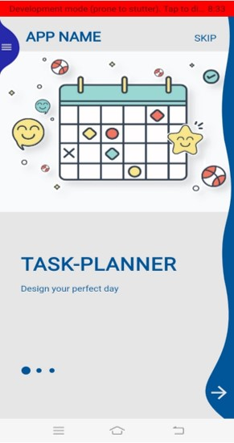
### Onboarding screen-2
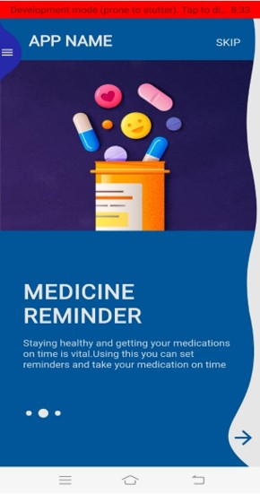
### Onboarding screen-3
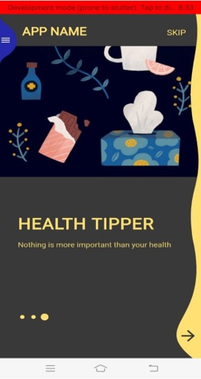
### App Menu bar
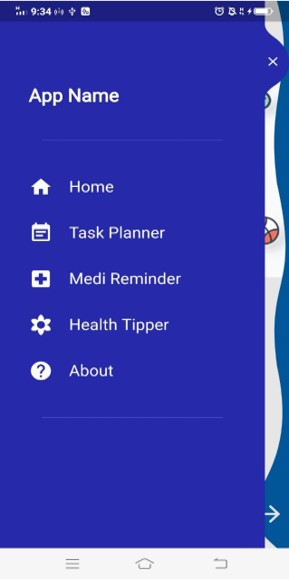
### Onboarding screen of task planner
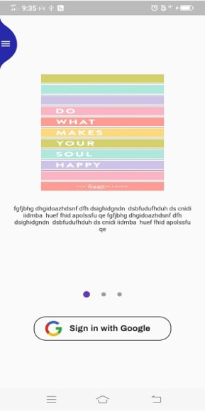
### Tasks display page
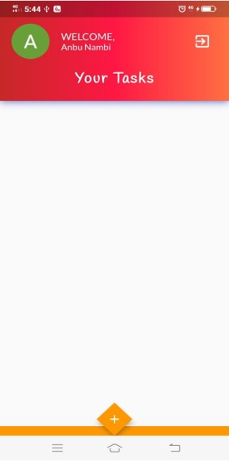
### Entry of tasks
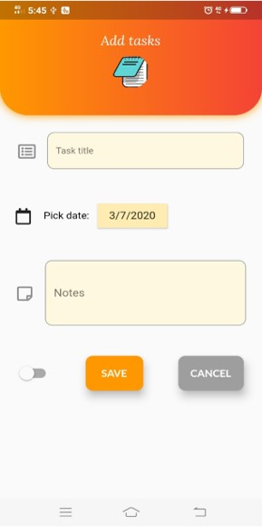
### An alert box to enter task if nothing was not added
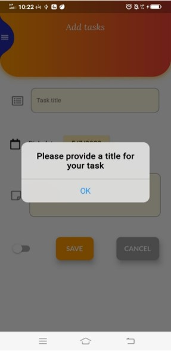
### Daily tasks displayed after adding and can be edited
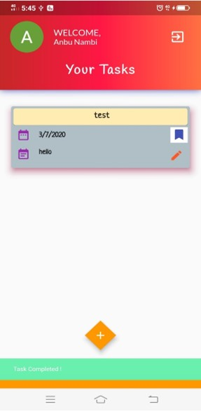
### Slide on any direction to delete
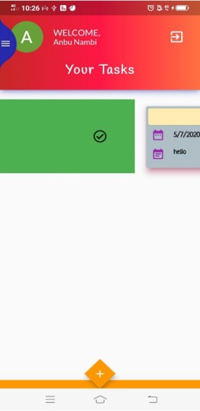
### Onboarding screen of medicine reminder
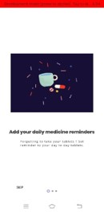
### Display home page / reminder page

### Onboarding screen of health tipper
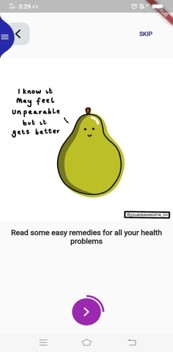
