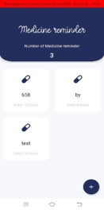

# Introduction:
This app was done using Flutter,Firebase & Firebase cloud-messaging .This app includes a task planner to keep track of daily tasks and organize the tasks based on importance; a medicine reminder that notifies the user to take medicines on time; a health tipper consisting of some health tips and ways to overcome potential health issues.  

## Implementation:
1.For task planner, the user can:
Login with google
Add, edit and bookmark the tasks
Delete completed tasks

2.For the medicine reminder, the user can:
Add medicine, dose, medicine type, time interval, reminder time
The user will get notification at  the reminder time

3.For the health-tipper, the user can:
Read the health related articles

## Tools used:
BACKEND:             Firebase

FRONTEND:          Flutter framework

EDITORS USED:   Android studio
			     Visual studio code

## App Screenshots
### Splash Screen

### Onboarding screen-1

### Onboarding screen-2

### Onboarding screen-3

### App Menu bar

### Onboarding screen of task planner

### Tasks display page

### Entry of tasks

### An alert box to enter task if nothing was not added

### Daily tasks displayed after adding and can be edited

### Slide on any direction to delete

### Onboarding screen of medicine reminder

### Display home page / reminder page

### Add reminder page

### Medicine reminder details page

### Notification panel

### Delete reminder alert-box

### Onboarding screen of health tipper

### Health related articles/ facts titles display page

### Contents sample page

